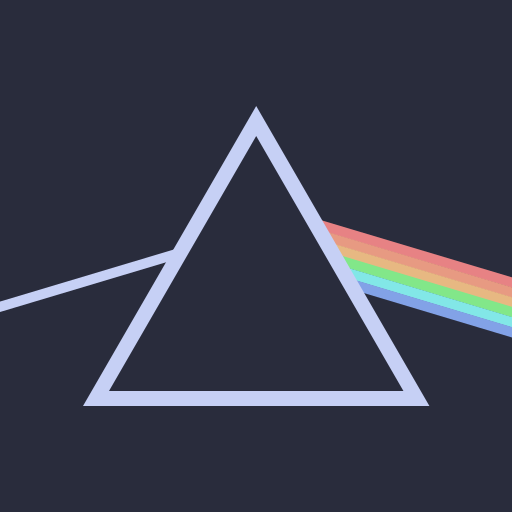

<div align="center">
    
    <h1>@rbxts/prism</h1>
    <p>Create custom data-driven user interfaces with <a href="https://github.com/littensy/vide/">@rbxts/vide</a></p>
</div>

## Packages 📦

This project is made of two seperate packages.

- [`@rbxts/prism`](https://www.npmjs.com/package/@rbxts/prism)
- [`@rbxts/prism-kit`](https://www.npmjs.com/package/@rbxts/prism-kit)

As the name suggests, `prism-kit` contains pre-built UI components for use with `prism`. However, you can design your own components.

## Installation 📦

```bash
pnpm i @rbxts/prism @rbxts/prism-kit
```

## Features 🎨

- Buttons like `Primary`, `Secondary`, and `Outlined`.
- Utility classes like `Rounded`, `Stroke`, and `List`.
